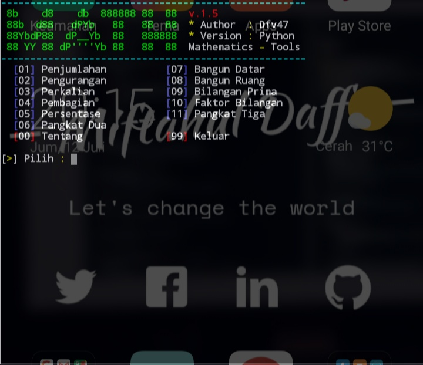

# [ PyMath v.1.0 ]

PyMath is a Mathematic project in python script 

# [ PyMath feature ]
- [x] penjumlahan
- [x] pengurangan
- [x] perkalian
- [x] pembagian
- [x] pangkat 2
- [x] pangkat 3
- [x] bangun datar
- [x] bangun ruang
- [x] bilangan prima
- [x] faktor bilangan

# [ Installation ]
```
$ apt update upgrade
$ apt install python2 git
$ git clone https://github.com/md4fv/pymath
$ cd pymath
$ python3 pymath.py
```
# [ Screenshot ]


# [ Thanks to]
https://github.com/md4fv<br>
https://github.com/blackcodercrush<br>
